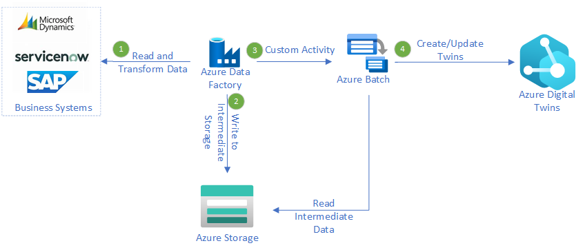

# Azure Digital Twins Batch Update Prototype

This repository serves as a prototype for being able to update Azure Digital Twins in a batch fashion using Azure Data Factory.  This pattern applies when you have systems that follow traditional ETL patterns and you have Digital Twins that need to be updated from them.

## Architecture

_Download an [Visio file](Docs/media/azure-digital-twins-batch-update-diagram.vsdx) of this architecture._

### Dataflow

1. Azure Data Factory uses either a Copy Data Activity or a Mapping Data Flow source to connect to the business system and copy the data to a temporary location.
2. A Mapping Dataflow handles any transformations and outputs a file for each twin that needs to be processed.
3. A Metadata Activity retrieves the list of files, loops through them, and calls a Custom Activity.
4. Azure Batch creates a task for each file which executes the custom code to interface with Azure Digital Twins.

## Prerequisites
1. Visual Studio 2022
2. Clone this repo.  You will point your ADF configuration to your new instance.

## Setup Instructions
1. Deploy the following Azure Resources
    - Azure Digital Twins (ADT)
    - Azure Data Factory (ADF)
    - Azure Batch
    - Azure Storage v2
    - Azure SQL Database
    - Azure Key Vault
    - User Managed Identity
2. Storage Account.
    - Create the following blob containers.
        - customactivity
        - inputfiles
        - twinupdatelocation
    - Grant Storage Blob Data Reader to the user managed identity.
3. Azure Batch
    - Grant ADF Contributor rights.
    - Create a Pool named 'adfpoolwindows':
        - Windows 2022 Data Center Core and make sure to select a User Assigned Identity and select your User Managed Identity.  This will allow the code to update ADT.
        - Select Auto scale
            - AutoScale Evaluation Interval: 5
            - Formula: 
                - `startingNumberOfVMs = 1;
                maxNumberofVMs = 25;
                pendingTaskSamplePercent = $PendingTasks.GetSamplePercent(180 * TimeInterval_Second);
                pendingTaskSamples = pendingTaskSamplePercent < 70 ? startingNumberOfVMs : avg($PendingTasks.GetSample(180 * TimeInterval_Second));
                $TargetDedicated=min(maxNumberofVMs,pendingTaskSamples);`
4. Key Vault
    - Create a policy to give the ADF resource list and get permissions on Secrets.  
    - Create the following secrets:
        - BatchStorage
            - enter the storage account key.  This is needed so that ADF can generate SAS tokens for the job files when it triggers Azure Batch.
        - BizAppSql
            - In this example, we need to be able to retrieve the sql credentials from key vault.
5. Azure SQL
    - Create a new database instance named 'bizsystwinDB'
    - Create the organization table and data.
        - `CREATE TABLE [dbo].[Organization]([OrgID] [varchar](50) NOT NULL,[Name] [varchar](50) NULL,[Division] [varchar](50) NULL,[Location] [varchar](50) NULL) ON [PRIMARY]`
        - `INSERT [dbo].[Organization] ([OrgID], [Name], [Division], [Location]) VALUES (N'org1', N'electrical', N'electgen', N'12')`
        - `INSERT [dbo].[Organization] ([OrgID], [Name], [Division], [Location]) VALUES (N'org2', N'natural gas', N'gasdist', N'13')`
        - `INSERT [dbo].[Organization] ([OrgID], [Name], [Division], [Location]) VALUES (N'org3', N'water', N'hydro', N'14')`
        - `INSERT [dbo].[Organization] ([OrgID], [Name], [Division], [Location]) VALUES (N'org4', N'truck', N'trucking', N'15')`
6. Azure Digital Twins
    - Grant the managed identity Azure Digital Twins Owner permissions to ADT
    - Create the models and twins in the Digital Twins Explorer
        - Base Model
            - `{
                 "@id": "dtmi:assetmodel:iiotbase;1",
                 "@context": [
                  "dtmi:dtdl:context;2"
                 ],
                 "@type": "Interface",
                 "displayName": "Base IIOT Interface",
                 "contents": [
                  {
                   "@type": "Property",
                   "name": "Name",
                   "schema": "string"
                  },
                  {
                   "@type": "Property",
                   "name": "AssetId",
                   "schema": "string"
                  }
                 ]
                }`
        - Enterprise Model
            - `{
                "@id": "dtmi:assetmodel:enterprise;1",
                 "@context": [
                  "dtmi:dtdl:context;2"
                 ],
                 "@type": "Interface",
                 "extends": [
                  "dtmi:assetmodel:iiotbase;1"
                 ],
                 "displayName": "Enterprise",
                 "contents": []
                }`
    - Create instances of the Enterprise twins
        - The twin name must be 'org1','org2','org3', and 'org4'.  You can set any other values to whatever you'd like.

7. Azure Data Factory
    - Setup github integration and point to the ADF folder of your repo.
    - Update the Linked Services to point to your azure resources.  Verify the connections!
    - Update the Global Parameters with the url's to your azure resources.  

8. Custom Activity
    - Publish the custom activity to a temp folder called 'publish'.
    - Zip the folder and subfolders into 'publish.zip'.
    - Copy the zip and RunActivity.bat into the 'customactivity' storage container.  The custom activity in ADF is configured to run this code.
     
    
## Run the Batch Job

1. In Azure Data Factory, select the UpdateOrganizationTwins pipeline and then Trigger Now.
2. In the pipeline monitoring, you'll see the mapping data flow retrieve the data from the sql database and write each record as a separate file.
3. You then will see the pipeline looping through each file and triggering an Azure Batch job to process the file.
4. In Azure Batch, you'll see the jobs that need to be run, the status of each, and the logs as they run.
5. In Azure Digital Twins, you'll see the twins are now updated with the data that came from SQL.

## Notes
We took some of the best practices outlined in this [blog](https://mrpaulandrew.com/2018/11/12/creating-an-azure-data-factory-v2-custom-activity/) to use as a foundation to be able to run and debug the Custom Activity locally.
